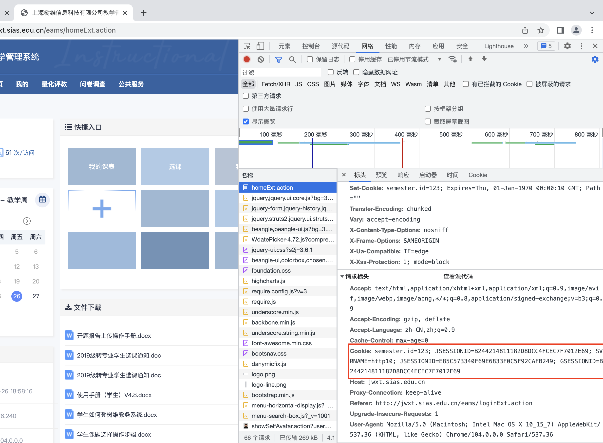
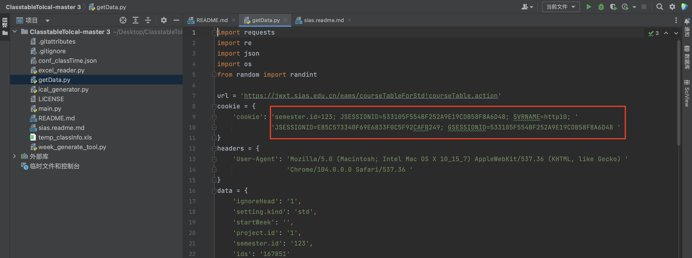

# 郑州西亚斯学院 ClasstableToIcal 辅助工具
## **致敬 SunsetYe66**

>https://github.com/SunsetYe66/ClasstableToIcal.git

方便我们西亚斯同志使用 shawnye 大神的 ClasstableTolacal 增加了getDate文件，需要手动运行。

该工具可以方便地将课程表转换为 .ics 格式以导入各种设备的「日程」中。

> 我是初学者，并不专业，多参考原作者

> 思路：爬取教务系统上的源代码，匹配出需要的内容后结合大神的工具快速生成日历文件，省去Excel文件的编辑和读取步骤

# 准备
>浏览器：谷歌浏览器 环境：Python3.8

修改 Cookie , 需要使用你登陆教务系统后的 Cookie。



>F12 拷贝后，粘贴到 getData.py 文件里


```python
cookie = {
    'cookie': '拷贝你的cookie，到文件中'
}
```


# 运行

>第一步：运行 getData.py 生成一个你的课表文件 conf_classInfo.json

>第二步：进入[SunsetYe66的仓库](https://github.com/SunsetYe66/ClasstableToIcal.git)


>西亚斯的同学注意了，运行大佬的的 main.py 可忽略命令 2 。
直接运行 3 就好了


# 文件说明
### conf_classTime.json

西亚斯同学无需修改

```json
 {
        "name": "第 1 节",
        "startTime": "080000",
        "endTime": "084500"
    }
```


### conf_classInfo.json
首先运行 getDate.py 获取
```json
 {
        "ClassName": "会计学",
        "StartWeek": 1.0,
        "EndWeek": 16.0,
        "WeekStatus": 0.0,
        "Weekday": 1.0,
        "ClassStartTimeId": 7.0,
        "ClassEndTimeId": 8.0,
        "Classroom": "某教室",
        "ClassSerial": "22231.000000-3.25",
        "Teacher": "李老师"
    }
```
## **致敬 SunsetYe66**

>https://github.com/SunsetYe66/ClasstableToIcal.git


## 欢迎交流沟通
><a href="mailto:qinjian@icloud.com">Email：qinjian0420@icloud.com</a>
